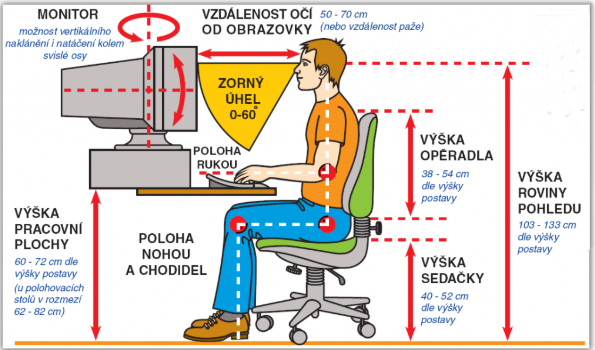

# 🌱 Zdravé používání počítače

## 🪑 Ergonomie při práci s počítačem

### Správné sezení
- **Výška židle:** Nohy položené na zemi, stehna vodorovně
- **Záda:** Opřená o opěradlo, rovná páteř, podporovaná lordóza
- **Ruce:** Lokty v úhlu 90-110°, zápěstí rovná a neutrální
- **Hlava:** Rovná, pohled směrem dopředu, brada mírně vtažená

### Nastavení monitoru
- **Vzdálenost:** 50-70 cm od očí (délka paže)
- **Výška:** Horní okraj monitoru ve výšce očí nebo mírně pod
- **Sklon:** Mírně skloněný dozadu (10-20°)
- **Jas:** Přirozený, odpovídající okolnímu osvětlení
- **Kontrast:** Dostatečný, ale ne příliš ostrý

### Pozice klávesnice a myši
- **Klávesnice:** Ve výšce loktů, zápěstí rovná
- **Myš:** Ve stejné výši jako klávesnice
- **Podložky pod zápěstí:** Pouze při přestávkách, ne během psaní
- **Vzdálenost:** Klávesnice a myš blízko těla

### Pracovní prostředí
- **Osvětlení:** Dostatečné, bez odlesků na monitoru
- **Teplota:** 20-24°C, dobrá ventilace
- **Hluk:** Minimální rušivé zvuky
- **Pořádek:** Organizované pracovní místo

## 👀 Ochrana zraku

### Pravidlo 20-20-20
- **Každých 20 minut** si udělejte přestávku
- **Na 20 sekund** se podívejte na něco **20 stop daleko** (6 metrů)
- **Účel:** Relaxace očních svalů a snížení únavy
- **Tip:** Nastavte si upomínku v telefonu nebo počítači

### Péče o oči během práce
- **Častější mrkání** - zvlhčování očí (obvykle mrkáme méně u obrazovek)
- **Dostatečné osvětlení** pracovního místa - ne pouze světlo z monitoru
- **Správný kontrast** - text černý na bílém pozadí je nejčitelnější
- **Velikost písma** - dostatečně velké pro pohodlné čtení

### Ochrana před modrým světlem
- **Modrý filtr** v nastavení Windows (Night Light)
- **Brýle s filtrem** - konzultace s očním lékařem
- **Tmavý režim** aplikací - zejména večer
- **Snížení jasu** před spaním

## ⏰ Časové limity a digitální hygiena

### Doporučené limity
- **Pracovní dny:** Maximálně 2 hodiny denně (mimo školní práci)
- **Víkendy:** O něco volnější, ale ne celý den u obrazovky
- **Přestávky:** Minimálně 15 minut každou hodinu aktivní práce

### Zdravé návyky
- **Žádné obrazovky 1-2 hodiny před spaním** - lepší kvalita spánku
- **Pravidelné venkovní aktivity** - každý den alespoň 1 hodina
- **Sport a pohyb** - kompenzace sezení u počítače
- **Sociální kontakt** - společenské aktivity bez technologií
- **Koníčky offline** - čtení, kreslení, hudba, rukodělné práce

## � Fyzické cvičení a přestávky

### Cviky pro uvolnění během práce

#### Cviky pro krk a ramena (každých 30 minut)
1. **Rotace hlavy** - pomalu 5x doleva, 5x doprava
2. **Natažení krku** - hlava doprava, levá ruka dolů, držet 15 sekund
3. **Zvedání ramen** - ramena k uším, držet 5 sekund, uvolnit
4. **Kroužení rameny** - 10x dopředu, 10x dozadu

#### Cviky pro záda a páteř
1. **Protažení páteře** - ruce nad hlavu, natáhnout se ke stropu
2. **Rotace trupu** - sezeno otočit trup doleva/doprava
3. **Sklon vpřed** - pozvolna se předklonit, ruce volně visí
4. **Kočičí hřbet** - na čtyřech prohnout a vyhrnout záda

#### Cviky pro zápěstí a prsty
1. **Kroužení zápěstími** - 10x každým směrem
2. **Natažení zápěstí** - paže natažená, druhá ruka táhne dlaň k sobě
3. **Pěstičky** - sevřít pěst, rozevřít prsty, 10x opakovat
4. **"Piano"** - rychle pohybovat prsty jako při hře na klavír

### Aktivní přestávky
- **Chůze** - projít se po bytě/škole
- **Protahování** - celotělové protažení
- **Dýchací cviky** - hluboké dýchání břichem
- **Oční gymnastika** - pohyby očí všemi směry

## 🧘 Mentální zdraví a stres

### Rozpoznání digitální únavy
**Fyzické příznaky:**
- Bolesti hlavy
- Pálení nebo únava očí
- Napětí v krku a ramenech
- Problémy se spaním

**Psychické příznaky:**
- Podrážděnost
- Problémy s koncentrací
- Pocit přetížení informacemi
- Úzkost při odpojení od zařízení

### Strategie pro zvládání digitálního stresu
- **Digital detox** - pravidelné dny bez technologií
- **Mindfulness** - vědomé používání technologií
- **Hranice** - jasné časové limity
- **Alternativní aktivity** - koníčky mimo obrazovku

### Kvalitní spánek
- **Routine před spaním** - bez obrazovek
- **Teplota ložnice** - 18-20°C optimální
- **Tma** - žádné svítící displeje
- **Pravidelnost** - stejný čas usínání a buzení

## 🔒 Bezpečnost na internetu

### Základní pravidla ochrany
- **Nikdy nesdílejte osobní údaje** (adresa, telefon, škola) s neznámými
- **Opatrnost při stahování** souborů z neznámých zdrojů
- **Silná hesla** a jejich pravidelná změna (každé 3 měsíce)
- **Nahlášení nevhodného obsahu** učiteli nebo rodiči okamžitě

### Rozpoznání online hrozeb
- **Phishing** - falešné emaily žádající o hesla
- **Malware** - škodlivý software v příloze
- **Sociální inženýrství** - manipulace k vyzrazení informací
- **Kyberšikana** - agrese na sociálních sítích

### Bezpečné chování online
- **Ověřování zdrojů** - kontrola pravosti webových stránek
- **Privátní profily** - nastavení soukromí na sociálních sítích
- **Nedůvěřivost k neznámým** - online i offline pravidla platí stejně
- **Backup důležitých dat** - záloha proti ransomware

---

⚡ **Pamatujte:** Technologie jsou skvělými nástroji, ale důležité je je používat uvědoměle a s mírou!
